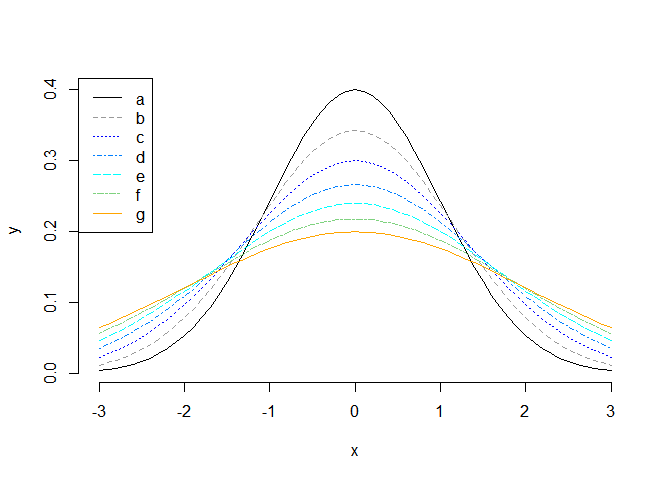
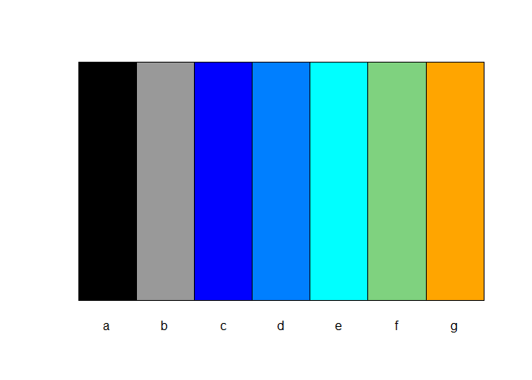

# mtb - Toolkit for Assisting Kitchen and Garden Projects

<!-- badges: start -->

[](https://CRAN.R-project.org/package=mtb)
[](https://lifecycle.r-lib.org/articles/stages.html#experimental)
<!-- badges: end -->

The purpose of this package is to share a collection of functions the
author wrote during weekends for managing kitchen and garden tasks,
e.g. making plant growth charts or Thanksgiving kitchen schedule charts,
etc. Functions may include but are not limited to: (1) aiding in
summarizing time-related data; (2) generating axis transformations from
data; and (3) aiding `Markdown` (with `HTML` output) and `Shiny` file
editing.

## Installation

You can install the latest version of mtb like so:

``` r
install.packages('mtb')
```

You can install the development version of mtb like so:

``` r
devtools::install_github('yh202109/mtb',ref='main')
```

## Example - Selecting and Testing Colors

This is a basic example which shows you how to automatically select
colors for individual groups by 3 major colors, blue, cyan and orange.
The first argument represents group values. The second argument specify
the order of $a$ to $g$, the third argument specifies that group $a$ is
assigned to the black color, and group $b$ is assigned to the gray
color.

``` r
library(mtb)
colvect = color_set_palette(c('a','b','d','c','e','f','g'), c(1,2,4,3,5,6,7),black='a',gray9='b',cols=c('blue', 'cyan','orange'))
```

This is a basic example which shows you how to quickly test selected
colors:

``` r
color_test_palette(colvect, type='line')
```



``` r
color_test_palette(colvect, type='bar')
```



## Example - *R markdown* or *Shiny* components

This is a basic example which shows you how to format a string:

``` r
add_colored_str('Example - Warning', color=c(255,0,0), bold=TRUE, fontsize=1.5)
```

<span style="color: rgba(255,0,0,1); font-weight: bold;margin: 3px auto 3px auto; font-size:150%">Example - Warning</span>

This is an example which shows you how to add a default box:

``` r
add_colored_box(info='additional information')
```

<div style=" background-color: rgba( 51,122,183 , 0.2); margin: 3px auto 3px auto; width: 50% ; border-width: 0px 0px 0px 3px; border-color: rgba( 51,122,183 ,1); border-style: solid; padding: 1px 1px 1px 0px; border-radius: 0px 0px 5px 0px;"><b> &nbsp; <span style='font-size:110%;'> &#9749; </span><i> Note </i></b> <div style="background-color: rgba(255,255,255,0.75); padding: 10px 20px 10px 20px; border-radius: 0px 0px 5px 0px;">additional information</div></div>

This is an example which shows you how to add a warning box:

``` r
add_colored_box(type='yellow-warning', info='Here is the warning message.')
```

<div style=" background-color: rgba( 230,200,60 , 0.2); margin: 3px auto 3px auto; width: 50% ; border-width: 0px 0px 0px 3px; border-color: rgba( 230,200,60 ,1); border-style: solid; padding: 1px 1px 1px 0px; border-radius: 0px 0px 5px 0px;"><b> &nbsp; <span style='font-size:110%;'> &#9888; </span><i> Warning </i></b> <div style="background-color: rgba(255,255,255,0.75); padding: 10px 20px 10px 20px; border-radius: 0px 0px 5px 0px;">Here is the warning message.</div></div>

## Example - Crosstab Summary

This is a basic example which shows you how to generate a crosstab from
a data frame with row-wise percentages:

``` r
df <- data.frame(
    A = c('foo','foo','foo','foo','foo','foo','bar','bar','baz','baz','baz'),
    D = c('apple','apple','apple','apple','banana','apple','banana','apple','banana','apple','banana'),
    E = c('red','blue','red','red','red','blue','blue','red','blue','red','blue')
)
result <- crosstab_from_list(df, rows=c("A"), cols=c("D","E"),
                             perct_within_index="A", report_type=1)
result$report
#>     A apple | blue banana | blue apple | red banana | red       All
#> 1 bar       0 (0%)       1 (50%)     1 (50%)       0 (0%)  2 (100%)
#> 2 baz       0 (0%)     2 (66.7%)   1 (33.3%)       0 (0%)  3 (100%)
#> 3 foo    2 (33.3%)        0 (0%)     3 (50%)    1 (16.7%)  6 (100%)
#> 4 All    2 (18.2%)     3 (27.3%)   5 (45.5%)     1 (9.1%) 11 (100%)
```

# Use of AI Assistance (v0.1.10 and later)

<div style=" background-color: rgba( 51,122,183 , 0.2); margin: 3px auto 3px auto; width: 95% ; border-width: 0px 0px 0px 3px; border-color: rgba( 51,122,183 ,1); border-style: solid; padding: 1px 1px 1px 0px; border-radius: 0px 0px 5px 0px;"><b> &nbsp; <span style='font-size:110%;'> &#9749; </span><i> Note </i></b> <div style="background-color: rgba(255,255,255,0.75); padding: 10px 20px 10px 20px; border-radius: 0px 0px 5px 0px;">This section is primarily generated by AI.</div></div>

Beginning with version 0.1.10, selected components of this package —
including certain vignettes, Shiny applications, and supporting
documentation — are developed with the assistance of an AI coding tool
([Posit
Assistant](https://docs.posit.co/ide/user/ide/guide/tools/ai-coding-assistant.html))
under direct human direction.

The following principles govern AI-assisted work in this package:

- **Human direction.** All AI-generated content is produced in response
  to explicit prompts authored by the package maintainer. The maintainer
  reviews, tests, and accepts or modifies every AI suggestion before it
  is committed.
- **Disclosure in documents.** Vignettes and reports that contain
  AI-assisted content carry a callout note at the top of the document
  identifying that the content was generated with AI assistance and
  indicating the review status.
- **No change to package API.** Exported R functions, their arguments,
  and their documented behaviour are authored and validated by the
  maintainer. AI assistance is used primarily for analytical documents,
  interactive tools, and boilerplate prose — not for the core package
  code.
- **Accuracy is not guaranteed.** AI-generated content may contain
  errors. Readers and users are encouraged to verify numerical results
  and statistical claims independently before relying on them.

# Warranty and Disclaimer

<div style=" background-color: rgba( 51,122,183 , 0.2); margin: 3px auto 3px auto; width: 95% ; border-width: 0px 0px 0px 3px; border-color: rgba( 51,122,183 ,1); border-style: solid; padding: 1px 1px 1px 0px; border-radius: 0px 0px 5px 0px;"><b> &nbsp; <span style='font-size:110%;'> &#9749; </span><i> Important </i></b> <div style="background-color: rgba(255,255,255,0.75); padding: 10px 20px 10px 20px; border-radius: 0px 0px 5px 0px;">THIS SOFTWARE IS PROVIDED BY THE COPYRIGHT HOLDERS AND CONTRIBUTORS  AS IS  AND ANY EXPRESS OR IMPLIED WARRANTIES, INCLUDING, BUT NOT LIMITED TO, THE IMPLIED WARRANTIES OF MERCHANTABILITY AND FITNESS FOR A PARTICULAR PURPOSE ARE DISCLAIMED. IN NO EVENT SHALL THE AUTHORS OR COPYRIGHT HOLDERS BE LIABLE FOR ANY CLAIM, DAMAGES OR OTHER LIABILITY.</div></div>
