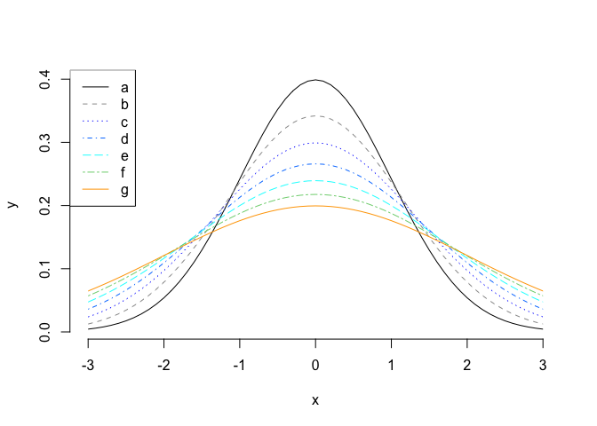

# mtb - Toolkit for Assisting Kitchen and Garden Projects

<!-- badges: start -->

[](https://CRAN.R-project.org/package=mtb)
[](https://lifecycle.r-lib.org/articles/stages.html#experimental)
[](https://cran.r-project.org/package=mtb)
<!-- badges: end -->

The purpose of this package is to share a collection of functions the
author wrote during weekends for managing kitchen and garden tasks,
e.g. making plant growth charts or Thanksgiving kitchen schedule charts,
etc. Functions might include but not limited to: (1) aiding summarizing
time related data; (2) generating axis transformation from data; and (3)
aiding `Markdown` (with `HTML` output) and `Shiny` files editing.

## Installation

You can install the newest version of mtb like so:

``` r
install.packages('mtb')
```

You can install the development version of mtb like so:

``` r
devtools::install_github('yh202109/mtb',ref='main')
```

## Example - Selecting and Testing Colors

This is a basic example which shows you how to automatically select
colors for individual groups by 3 major colors, blue, cyan and orange.
The first argument represent group values. The second argument specify
the order of $a$ to $g$, the third argument specifies that group $a$ is
assigned to the black color, and group $b$ is assigned to the gray
color.

``` r
library(mtb)
colvect = color_set_palette(c('a','b','d','c','e','f','g'), c(1,2,4,3,5,6,7),black='a',gray9='b',cols=c('blue', 'cyan','orange'))
```

This is a basic example which shows you how to quickly test selected
colors:

``` r
color_test_palette(colvect, type='line')
```



``` r
color_test_palette(colvect, type='bar')
```


## Example - *R markdown* or *Shiny* components

This is a basic example which shows you how to format a string:

``` r
add_colored_str('Example - Warning', color=c(255,0,0), bold=TRUE, fontsize=1.5)
```

<span style="color: rgba(255,0,0,1); font-weight: bold;margin: 3px auto 3px auto; font-size:150%">Example - Warning</span>

This is an example which shows you how to add a default box:

``` r
add_colored_box(info='additional information')
```

<div style=" background-color: rgba( 51,122,183 , 0.2); margin: 3px auto 3px auto; width: 50% ; border-width: 0px 0px 0px 3px; border-color: rgba( 51,122,183 ,1); border-style: solid; padding: 1px 1px 1px 0px; border-radius: 0px 0px 5px 0px;"><b> &nbsp; <span style='font-size:110%;'> &#9749; </span><i> Note </i></b> <div style="background-color: rgba(255,255,255,0.75); padding: 10px 20px 10px 20px; border-radius: 0px 0px 5px 0px;">additional information</div></div>

This is an example which shows you how to add a warning box:

``` r
add_colored_box(type='yellow-warning', info='Here is the warning message.')
```

<div style=" background-color: rgba( 230,200,60 , 0.2); margin: 3px auto 3px auto; width: 50% ; border-width: 0px 0px 0px 3px; border-color: rgba( 230,200,60 ,1); border-style: solid; padding: 1px 1px 1px 0px; border-radius: 0px 0px 5px 0px;"><b> &nbsp; <span style='font-size:110%;'> &#9888; </span><i> Warning </i></b> <div style="background-color: rgba(255,255,255,0.75); padding: 10px 20px 10px 20px; border-radius: 0px 0px 5px 0px;">Here is the warning message.</div></div>

# Warranty and Disclaimer

<div style=" background-color: rgba( 51,122,183 , 0.2); margin: 3px auto 3px auto; width: 95% ; border-width: 0px 0px 0px 3px; border-color: rgba( 51,122,183 ,1); border-style: solid; padding: 1px 1px 1px 0px; border-radius: 0px 0px 5px 0px;"><b> &nbsp; <span style='font-size:110%;'> &#9749; </span><i> Important </i></b> <div style="background-color: rgba(255,255,255,0.75); padding: 10px 20px 10px 20px; border-radius: 0px 0px 5px 0px;">THIS SOFTWARE IS PROVIDED BY THE COPYRIGHT HOLDERS AND CONTRIBUTORS  AS IS  AND ANY EXPRESS OR IMPLIED WARRANTIES, INCLUDING, BUT NOT LIMITED TO, THE IMPLIED WARRANTIES OF MERCHANTABILITY AND FITNESS FOR A PARTICULAR PURPOSE ARE DISCLAIMED. IN NO EVENT SHALL THE AUTHORS OR COPYRIGHT HOLDERS BE LIABLE FOR ANY CLAIM, DAMAGES OR OTHER LIABILITY.</div></div>
